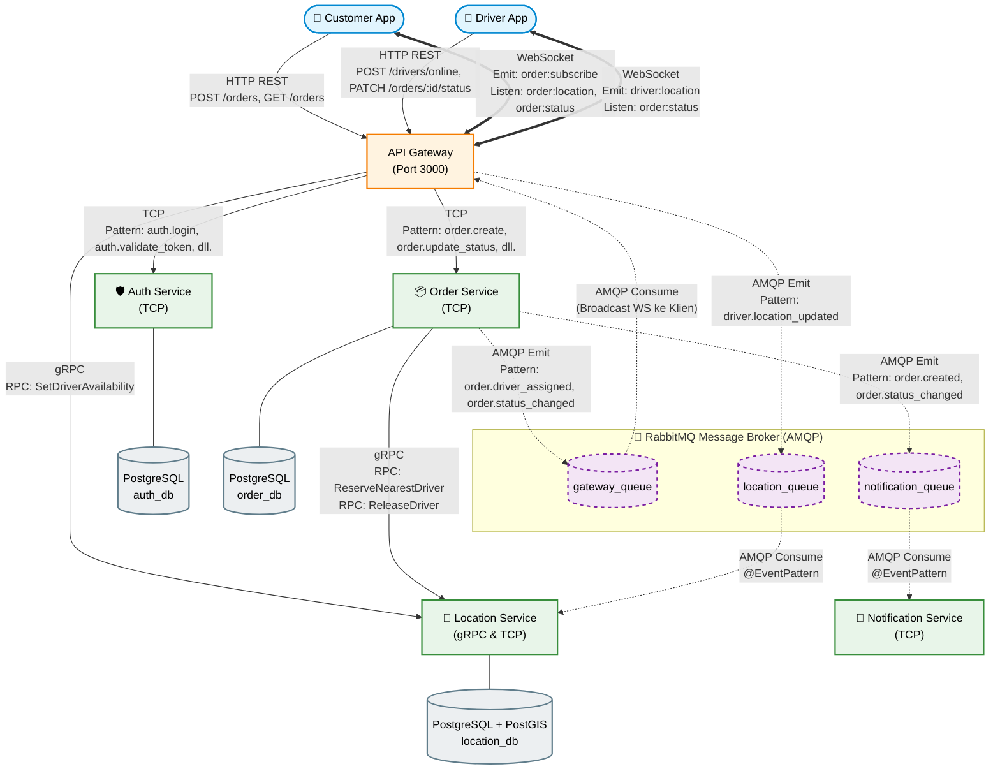

# On-Demand Delivery & Fleet Tracking

Proyek latihan: mini sistem kurir instan (ala Gojek/Lalamove) dengan arsitektur microservice NestJS dan PostGIS. Customer membuat order, sistem otomatis memilih driver terdekat, dan customer bisa melihat posisi driver secara real-time.

> Bukan untuk produksi. Tujuannya belajar: TCP, gRPC, RabbitMQ (event-driven), hybrid app, PostGIS, dua ORM (Prisma dan TypeORM), WebSocket, dan Swagger.

## Arsitektur



| Service      | Transport                         | Tugas                                                      |
| ------------ | --------------------------------- | ---------------------------------------------------------- |
| Gateway      | HTTP + WebSocket + RMQ            | Pintu masuk client, JWT guard, Swagger, WebSocket tracking |
| Auth         | TCP                               | Register, login, validasi token                            |
| Order        | TCP + gRPC client + RMQ publisher | Siklus hidup order, state machine, assign driver           |
| Location     | gRPC + RMQ consumer               | Posisi driver, pencarian terdekat (PostGIS), kunci driver  |
| Notification | RMQ consumer                      | Mengonsumsi event order dan mencatat notifikasi (log)      |

Dokumentasi lengkap ada di folder [`docs/`](docs): PRD, SDD, TSD, rencana implementasi, dan ADR. Aturan kerja untuk agent/kontributor ada di [`AGENTS.md`](AGENTS.md).

## Prasyarat

- [Bun](https://bun.sh)
- Docker dan Docker Compose
- Node.js LTS (dipakai Nest CLI)

## Setup

```bash
cp .env.example .env
docker compose up -d          # PostgreSQL + PostGIS dan RabbitMQ
bun install
bun run db:generate:auth
bun run db:migrate:all        # auth (Prisma), order dan location (TypeORM)
```

`docker/init.sql` (pembuatan database dan extension PostGIS) hanya berjalan saat volume Postgres pertama kali dibuat. Untuk mengulang dari nol: `docker compose down -v`.

## Menjalankan

Satu perintah untuk kelima service:

```bash
bun run dev:all
```

Atau satu per satu (satu terminal per service):

```bash
bunx nest start gateway --watch
bunx nest start auth-service --watch
bunx nest start order-service --watch
bunx nest start location-service --watch
bunx nest start notification-service --watch
```

| Komponen                   | Alamat                                        |
| -------------------------- | --------------------------------------------- |
| Gateway (HTTP + WebSocket) | `http://localhost:3000`                       |
| Swagger                    | `http://localhost:3000/docs`                  |
| Auth (TCP)                 | `4001`                                        |
| Order (TCP)                | `4002`                                        |
| Location (gRPC)            | `50051`                                       |
| PostgreSQL                 | `5432` (`auth_db`, `order_db`, `location_db`) |
| RabbitMQ                   | `5672` (UI: `http://localhost:15672`)         |

Cek cepat: `curl localhost:3000/health` harus mengembalikan `{"status":"ok"}`.

## API

Dokumentasi interaktif (lengkap dengan contoh request dan respons) ada di `/docs`. Ringkasnya:

| Method | Path                                  | Role                                 |
| ------ | ------------------------------------- | ------------------------------------ |
| POST   | `/auth/register`, `/auth/login`       | publik                               |
| GET    | `/auth/me`                            | semua                                |
| POST   | `/drivers/online`, `/drivers/offline` | DRIVER                               |
| POST   | `/orders`                             | CUSTOMER                             |
| GET    | `/orders`, `/orders/:id`              | semua (hanya milik sendiri)          |
| PATCH  | `/orders/:id/status`                  | DRIVER (hanya driver yang di-assign) |

Status order: `PENDING → DRIVER_ASSIGNED → PICKED_UP → COMPLETED` (atau `NO_DRIVER_AVAILABLE`).

### WebSocket (Socket.IO)

Koneksi: `io("http://localhost:3000", { auth: { token: "<JWT>" } })`.

| Event             | Arah            | Role     | Keterangan                                                                                       |
| ----------------- | --------------- | -------- | ------------------------------------------------------------------------------------------------ |
| `driver:location` | client → server | DRIVER   | `{ lat, lng, orderId? }`; bila `orderId` ada dan milik driver itu, lokasi diteruskan ke customer |
| `order:subscribe` | client → server | CUSTOMER | `{ orderId }`; ack `{ ok, status, driverId }`                                                    |
| `order:location`  | server → client |          | `{ orderId, lat, lng, ts }`                                                                      |
| `order:status`    | server → client |          | `{ orderId, status, driverId? }` (ke customer dan driver)                                        |

## Mencoba

```bash
bun run scripts/seed-drivers.ts   # tiga driver online di sekitar Jakarta
bun run demo:ws                   # demo: order, ping lokasi, perubahan status via WebSocket
```

Atau lewat Swagger/Postman (`order-delivery-tracking.postman_collection.json`).

## Tes

```bash
bun run lint
bun run test         # unit test + tes integrasi Socket.IO (tanpa service lain)
bun run test:e2e     # e2e: butuh docker compose up -d dan semua service hidup
```

`test:e2e` menjalankan alur order penuh (HTTP + WebSocket) terhadap stack yang berjalan dan pengecekan kelengkapan Swagger, serta tes PostGIS Location (`location_test_db`).

## Skenario uji manual

| #   | Skenario                                          | Hasil yang diharapkan                                                                                     |
| --- | ------------------------------------------------- | --------------------------------------------------------------------------------------------------------- |
| 1   | Buat order, driver tersedia                       | Log Notification: `order.created` dan `order.driver_assigned` (2 log); Gateway menerima `driver_assigned` |
| 2   | `PATCH` `PICKED_UP` lalu `COMPLETED`              | Log `order.status_changed` di Notification; customer dan driver menerima `order:status`                   |
| 3   | Buat order tanpa driver                           | Status `NO_DRIVER_AVAILABLE`                                                                              |
| 4   | Matikan Notification, buat 2 order, nyalakan lagi | Pesan menumpuk di `notification_queue` (Ready naik), lalu terproses semua                                 |
| 5   | Matikan RabbitMQ, buat order                      | `POST /orders` tetap sukses; error publish tercatat di log Order                                          |
| 6   | Ping driver dengan koordinat tidak valid          | Log `warn` di Location, service tidak crash                                                               |
| 7   | Driver mengirim `orderId` milik driver lain       | Ditolak `FORBIDDEN`, tidak diteruskan ke room                                                             |
| 8   | Customer lain subscribe order orang lain          | Ditolak `FORBIDDEN`, tidak join room                                                                      |

## Bukti Acceptance Criteria

| AC                                | Bukti                                                            |
| --------------------------------- | ---------------------------------------------------------------- |
| 01 Auth dan role                  | e2e alur order, `auth-service.controller.spec`                   |
| 02 Assign otomatis / tanpa driver | e2e alur order, `order-service.service.spec`                     |
| 03 Driver terdekat                | `location-service.e2e-spec`, e2e alur order                      |
| 04 State machine                  | `order-state-machine.service.spec`, e2e alur order               |
| 05 Hanya driver yang di-assign    | `order-service.service.spec`, e2e alur order                     |
| 06 Event tercatat di Notification | log Notification (lihat bawah), `order-events.publisher.spec`    |
| 07 `order:location` ke customer   | `tracking.gateway.integration.spec`, e2e alur order, `demo:ws`   |
| 08 Swagger lengkap                | e2e (`/docs-json`), pengecekan manual `/docs`                    |
| 09 Satu driver tidak dobel        | `location-service.e2e-spec` (reservasi konkuren), e2e alur order |
| 10 Driver kembali tersedia        | e2e alur order                                                   |

Contoh log Notification untuk AC-06:

```text
[Nest] 785  - 10/08/2026, 3:44:37 AM     LOG [NotificationServiceController] {"event":"order.created","orderId":"1a0e7062-ca0f-473e-999a-1f5bfd2c8126","recipient":"521430c4-07e4-4711-a4a0-2f712a2fc1e9","message":"Order 1a0e7062-ca0f-473e-999a-1f5bfd2c8126 berhasil dibuat."}
[Nest] 785  - 10/08/2026, 3:44:37 AM     LOG [NotificationServiceController] {"event":"order.driver_assigned","orderId":"1a0e7062-ca0f-473e-999a-1f5bfd2c8126","recipient":"521430c4-07e4-4711-a4a0-2f712a2fc1e9","message":"Driver ditemukan untuk order 1a0e7062-ca0f-473e-999a-1f5bfd2c8126."}
[Nest] 785  - 10/08/2026, 3:44:37 AM     LOG [NotificationServiceController] {"event":"order.driver_assigned","orderId":"1a0e7062-ca0f-473e-999a-1f5bfd2c8126","recipient":"218c32b6-2388-46cd-8366-8242a92db4d7","message":"Kamu mendapat order 1a0e7062-ca0f-473e-999a-1f5bfd2c8126."}
[Nest] 785  - 10/08/2026, 3:44:43 AM     LOG [NotificationServiceController] {"event":"order.status_changed","orderId":"1a0e7062-ca0f-473e-999a-1f5bfd2c8126","recipient":"521430c4-07e4-4711-a4a0-2f712a2fc1e9","message":"Status order 1a0e7062-ca0f-473e-999a-1f5bfd2c8126 berubah menjadi PICKED_UP."}
```

## Struktur repo

```
apps/
  gateway/ auth-service/ order-service/ location-service/ notification-service/
libs/common/          # DTO, enum, konstanta, event, proto, util (tanpa entity ORM)
docs/                 # PRD, SDD, TSD, rencana implementasi, ADR
scripts/              # seed-drivers, demo WebSocket
docker/init.sql       # database dan extension PostGIS
```

## Keterbatasan yang disengaja

- Event RabbitMQ memakai `noAck` bawaan Nest (at-most-once di sisi consumer) dan publish best-effort tanpa outbox, jadi order bisa tersimpan tanpa event terkirim.
- `ReleaseDriver` setelah `COMPLETED` best-effort; bila gagal, driver tetap terkunci sampai diperbaiki manual.
- Room Socket.IO tersimpan di memori: hanya benar untuk satu instance Gateway (butuh Redis adapter bila di-scale).
- Tidak ada pembayaran, tarif dinamis, retry saat driver menolak, atau refresh token. Tarif flat.
- Jarak order dihitung garis lurus (`ST_Distance`), bukan rute jalan.

## Troubleshooting

| Gejala                                       | Penyebab / solusi                                                                                                                                    |
| -------------------------------------------- | ---------------------------------------------------------------------------------------------------------------------------------------------------- |
| `PRECONDITION_FAILED` dari RabbitMQ          | Opsi queue berbeda dari yang sudah ada; hapus queue lama di UI RabbitMQ lalu jalankan ulang                                                          |
| `POST /orders` selalu `NO_DRIVER_AVAILABLE`  | Driver stale (ping terakhir lebih dari `DRIVER_STALE_SECONDS`, default 60 detik); panggil `POST /drivers/online` lagi atau naikkan nilainya saat dev |
| `location_test_db` tidak ada saat `test:e2e` | `init.sql` tidak jalan ulang pada volume lama; buat database dan extension PostGIS manual atau `docker compose down -v`                              |
| Port 3000 atau 5000 terpakai                 | Ubah `GATEWAY_PORT` / `LOCATION_HTTP_PORT` di `.env`                                                                                                 |
| `test:e2e` gagal "Gateway tidak terjangkau"  | Jalankan `bun run dev:all` dulu                                                                                                                      |

## Yang dipelajari

- **Microservice NestJS:** tiga transport sekaligus (TCP, gRPC, RabbitMQ) dan hybrid app (HTTP/gRPC/RMQ dalam satu proses).
- **Event-driven:** durable queue, fan-out lewat beberapa queue, semantik `emit` vs `send`, `noAck`, dan keterbatasan tanpa outbox.
- **PostGIS:** `geography(Point,4326)`, index GiST, `ST_DWithin`, pencarian terdekat dengan `<->`, dan reservasi atomik dengan `FOR UPDATE SKIP LOCKED`.
- **Dua ORM:** Prisma untuk Auth, TypeORM + raw SQL untuk data spasial, dengan batas antar service tetap lewat DTO/proto/event.
- **WebSocket:** room per order dan per user, autentikasi handshake, validasi kepemilikan di server.
- **Dokumentasi dan tes:** Swagger, unit test, tes integrasi Socket.IO, dan e2e terhadap stack nyata.
