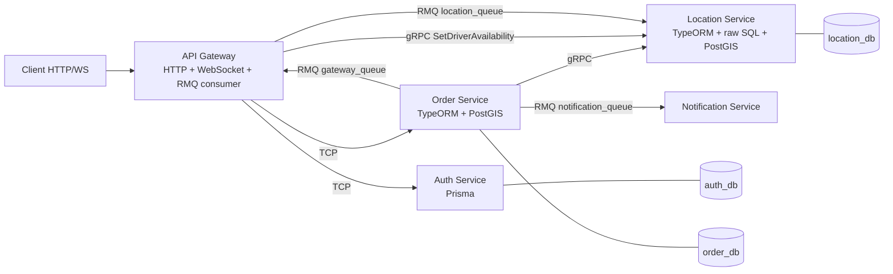

# SDD — System Design

## 1. Gambaran Arsitektur

Infrastruktur: satu instance PostgreSQL + PostGIS (3 database terpisah), satu RabbitMQ.

## 2. Tanggung Jawab Service

| Service | Memiliki | Tidak boleh |
|---|---|---|
| **Gateway** | HTTP API publik, Swagger, JWT guard, WebSocket, routing | Menyimpan data bisnis, akses DB |
| **Auth** | User, password hash, JWT issue/verify | Tahu soal order/lokasi |
| **Order** | Order, state machine, harga, jarak | Membaca DB Location/Auth |
| **Location** | Posisi & ketersediaan driver, query spasial | Tahu soal order/status |
| **Notification** | Konsumsi event, kirim/log notifikasi | Menyimpan data, dipanggil sinkron |

**Aturan batas:** tidak ada service yang membaca database service lain. Kontrak antar-service hanya lewat DTO/proto/event di `libs/common`, bukan entity ORM.

## 3. Jenis Komunikasi

| Dari → Ke | Transport | Jenis | Alasan |
|---|---|---|---|
| Gateway → Auth | TCP | request-response | validasi token/login perlu jawaban langsung |
| Gateway → Order | TCP | request-response | CRUD order |
| Order → Location | gRPC | request-response | lookup driver terdekat, kontrak ketat via proto |
| Gateway → Location | RMQ | event | ping frekuensi tinggi, tidak perlu jawaban |
| Order → Notification | RMQ | event | fire-and-forget |
| Order → Gateway | RMQ | event | dorong status ke WebSocket |

## 4. Alur Utama

### 4.1 Register/Login
Client → Gateway `POST /auth/login` → (TCP `auth.login`) Auth → JWT → Client.
Request terlindungi: Gateway guard → TCP `auth.validate_token` → `{ userId, role }` masuk ke `request.user`.

### 4.2 Driver online
`POST /drivers/online {lat,lng}` (role DRIVER) → Gateway → gRPC ke Location: upsert `driver_locations` dengan `is_available=true`.

> Catatan: Gateway memanggil Location untuk online/offline lewat gRPC `SetDriverAvailability` (Gateway punya gRPC client ke Location; itu satu-satunya pengecualian, hanya method ini).

### 4.3 Buat order dan auto-assign
1. Customer `POST /orders` → Gateway (guard) → TCP `order.create` (`customerId` diambil dari token).
2. Order: hitung jarak (`ST_Distance`), simpan `PENDING`.
3. Order → gRPC `ReserveNearestDriver(pickup, radius)`. Location mengunci satu driver secara atomik.
4. Ada driver (`found: true`) → status `DRIVER_ASSIGNED`, `driver_id` diisi, emit `order.driver_assigned`. Jika update DB gagal, kompensasi dengan `ReleaseDriver`. Jika tidak ada driver → `NO_DRIVER_AVAILABLE`.
5. Order emit event ke `notification_queue` dan `gateway_queue`.
6. Notification: log. Gateway: push `order:status` ke room `order:{id}` dan ke driver.

### 4.4 Update status
Driver `PATCH /orders/:id/status` → Order validasi (driver = yang di-assign, transisi legal) → simpan → emit `order.status_changed`.
Bila status berubah ke `COMPLETED`, panggil gRPC `ReleaseDriver` ke Location (best-effort) agar driver bebas untuk pesanan baru.

### 4.5 Tracking real-time
1. Driver kirim WS `driver:location {lat,lng,orderId?}`.
2. Gateway emit `driver.location_updated` ke `location_queue` (Location upsert).
3. Jika `orderId` ada → Gateway langsung emit `order:location` ke room `order:{orderId}`.
4. Customer WS `order:subscribe {orderId}` → Gateway cek kepemilikan (TCP `order.get`) → join room.

## 5. Catatan Desain Penting

- **Fan-out RMQ di NestJS:** transport RMQ Nest mengirim ke *satu queue*; banyak consumer di queue sama akan berbagi pesan (round-robin), bukan menerima semuanya. Karena `order.status_changed` dibutuhkan Notification **dan** Gateway, Order punya dua client RMQ (`notification_queue`, `gateway_queue`) dan emit ke keduanya. Ini keputusan sadar (ADR-006).
- **Hybrid app:** Gateway = HTTP + WebSocket + microservice RMQ listener. Location = gRPC server + RMQ listener.
- **Idempotensi event:** tidak diimplementasi (out of scope); catat sebagai keterbatasan.
- **Konsistensi:** Order menyimpan `driver_id` sebagai referensi longgar (tanpa FK lintas DB).
- **Keamanan:** tanpa auth antar-service (lokal). JWT hanya di sisi Gateway.

## 6. Non-Functional (secukupnya)
- Logging: `Logger` bawaan Nest, sertakan nama service; opsional `correlationId` di header/payload.
- Error: exception filter di Gateway menerjemahkan `RpcException` ke HTTP (lihat TSD §11).
- Performa: ping lokasi tiap ±3–5 detik per driver, upsert satu baris; cukup untuk skala latihan.

## 7. Keputusan Arsitektur
Lihat `05-adr.md`.
