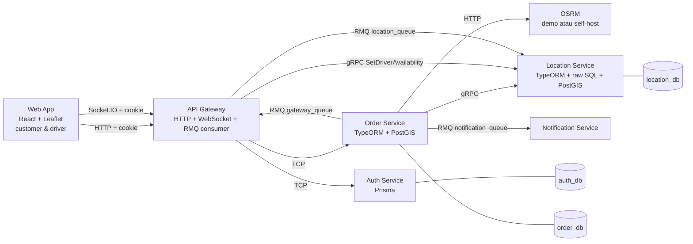
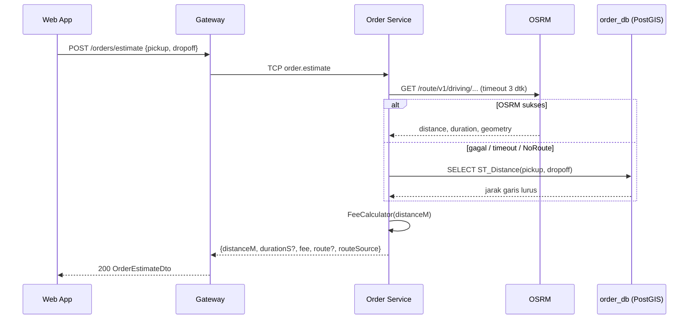
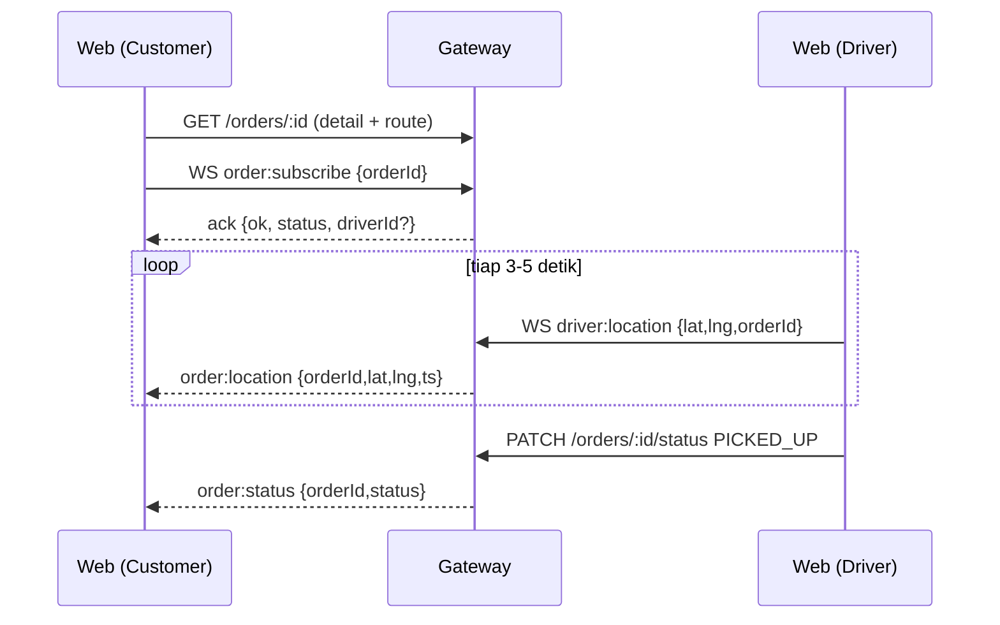
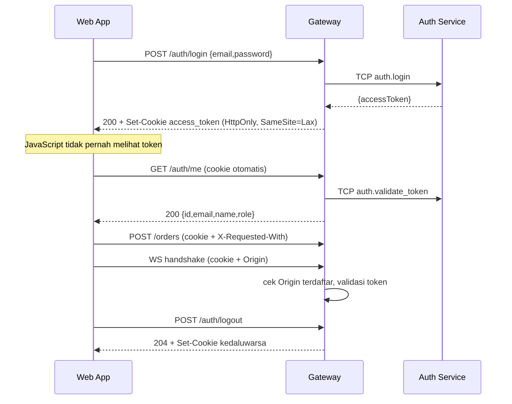

# SDD Addendum v1.1 — Arsitektur Web UI dan Rute

> Pelengkap `docs/02-sdd.md`. Menjelaskan komponen, alur, dan penanganan kegagalan yang berubah karena PRD v1.1 (`docs/06`). Kontrak teknis rinci ada di `docs/08`.

## 1. Gambaran Arsitektur (v1.1)

Yang baru: **Web App** dan **OSRM**. Tidak ada service Nest baru. OSRM adalah dependensi eksternal (bukan kode yang kita tulis); ia bisa server demo publik atau container di `docker-compose.yml`.

## 2. Tanggung Jawab Komponen (perubahan)

| Komponen | Memiliki | Tidak boleh |
|---|---|---|
| **Web App** | Tampilan, state UI, penggambaran peta, pemilihan titik, koneksi Socket.IO | Menghitung fee, jarak, atau rute sendiri; menyimpan data bisnis; memanggil OSRM langsung; membaca atau menyimpan token sesi |
| **Gateway** | Tetap; ditambah endpoint `estimate` dan `POST /auth/logout`, CORS dengan kredensial, pengaturan cookie sesi, pemeriksaan `Origin` WebSocket | Memanggil OSRM |
| **Order** | Ditambah: integrasi OSRM, perhitungan fee, penyimpanan rute | Mengandalkan OSRM sebagai satu-satunya jalan (wajib ada fallback) |
| **OSRM** | Perhitungan rute pada data jalan | Menyimpan data bisnis |

Alasan OSRM hanya dipanggil dari Order: SDD asli menetapkan Order sebagai pemilik "harga dan jarak". Dengan begitu fee satu sumber kebenaran, kunci API tidak bocor ke browser, dan fallback satu tempat.

## 3. Jenis Komunikasi (tambahan)

| Dari → Ke | Transport | Jenis | Alasan |
|---|---|---|---|
| Web → Gateway | HTTP | request-response | semua operasi REST; cookie sesi dikirim otomatis (`credentials: 'include'`) |
| Web ↔ Gateway | Socket.IO | dua arah | status order, posisi driver, ping lokasi driver; handshake diautentikasi lewat cookie |
| Order → OSRM | HTTP | request-response (timeout pendek) | hitung rute; ada fallback bila gagal |

## 4. Alur Baru dan Alur yang Berubah

### 4.3′ Buat order dan auto-assign (perubahan dari SDD §4.3)

1. Customer `POST /orders` → Gateway (guard) → TCP `order.create`.
2. **Order memanggil `RoutingService`**: minta rute ke OSRM (timeout). Hasil: `{distanceM, durationS, geometry}` atau `null` bila gagal.
3. Order menghitung `fee` dengan `FeeCalculator` dari `distanceM` (jarak jalan, atau garis lurus bila fallback).
4. Order menyimpan baris `PENDING` beserta `distance_m`, `duration_s`, `route`, `route_source`, dan `fee`.
5. Langkah reserve driver, kompensasi, dan event **tidak berubah** (SDD §4.3 langkah 3–6 dan ADR-013/014).

### 4.6 Estimasi order (baru)

Estimasi tidak menyimpan apa pun. `POST /orders` **tidak** memakai hasil estimasi dari client; ia menghitung ulang (server adalah sumber kebenaran). Perbedaan kecil antara estimasi dan order dimungkinkan hanya jika data OSRM berubah di antaranya.

### 4.7 Pelacakan di web (baru)

Aturan UI:
- Marker driver dipindahkan **dengan throttle** (maksimal sekali per ~1 detik) dan tidak membuat ulang peta.
- Koneksi Socket.IO dibuat hanya setelah `GET /auth/me` sukses, memakai `withCredentials: true` dan transport `websocket` (agar header `Origin` selalu ada), dan diputus saat logout.
- Sebelum ping pertama diterima, UI hanya menampilkan titik jemput/tujuan dan rute (bukan lokasi driver).
- Saat koneksi terputus, UI menampilkan indikator dan **polling** `GET /orders/:id` tiap ±15 detik sampai tersambung kembali, lalu subscribe ulang.

### 4.8 Driver: GPS atau simulator (baru)

- **Mode GPS:** `navigator.geolocation.watchPosition`, dikirim sebagai `driver:location` dengan jeda minimal ±3 detik. Membutuhkan `localhost` atau HTTPS.
- **Mode simulator:** UI mengambil `route` dari `GET /orders/:id`, lalu menggerakkan titik sepanjang polyline dengan kecepatan konfigurasi (mis. 30 km/jam), mengirim `driver:location` tiap 3 detik dengan `orderId`. Berhenti saat status `COMPLETED`.
- Keduanya memakai jalur backend yang sama (ADR-007); backend tidak tahu mana yang dipakai.

### 4.9 Sesi login dengan cookie (baru)

Aturan:
- Browser tidak pernah menyimpan atau membaca token. Status login ditentukan oleh `GET /auth/me` saat aplikasi dimuat.
- Gateway menerima token dari `Authorization: Bearer` lebih dulu, lalu dari cookie. Aturan CSRF hanya berlaku bila token berasal dari cookie.
- Untuk klien non-browser (Swagger, Postman, script, e2e) tidak ada perubahan: mereka tetap memakai Bearer.

## 5. Penanganan Kegagalan

| Kegagalan | Perilaku | Terlihat oleh user |
|---|---|---|
| OSRM timeout / down / `NoRoute` | Fallback `ST_Distance`; `routeSource = STRAIGHT_LINE`; `durationS` dan `route` null; log `warn` | Banner "estimasi garis lurus"; rute tidak digambar |
| Koordinat di luar `SERVICE_AREA_BBOX` | Ditolak sebelum memanggil OSRM | Pesan "di luar area layanan" |
| Gateway/Order mati saat estimasi | 503 `SERVICE_UNAVAILABLE` dari filter (perilaku v1.0) | Toast error + tombol coba lagi |
| Location mati saat order | Perilaku ADR-014 (order `NO_DRIVER_AVAILABLE`) | Pesan "tidak ada driver tersedia" |
| WebSocket putus | Indikator + polling + subscribe ulang | Badge "offline", data tetap berjalan |
| Cookie sesi kedaluwarsa (Max-Age mengikuti `exp` JWT, tanpa refresh) | Browser berhenti mengirim cookie → 401 `UNAUTHORIZED` | UI membersihkan cache sesi dan mengarahkan ke login dengan pesan sesi berakhir |
| Request tidak aman berbasis cookie tanpa header `X-Requested-With` | 403 `CSRF_HEADER_REQUIRED` | Toast error (seharusnya tidak terjadi dari UI sendiri) |
| Handshake WebSocket berbasis cookie dari origin tak terdaftar atau tanpa cookie | Koneksi ditolak dan diputus | Indikator offline; UI memeriksa `GET /auth/me` lalu mengarahkan ke login bila 401 |

## 6. Catatan Desain Penting

- **Snapshot rute.** Rute disimpan saat order dibuat dan tidak dihitung ulang selama perjalanan. Ini sama seperti `fee` dan `distance_m` (data historis). Konsekuensi: jika driver menyimpang, polyline tidak ikut berubah.
- **Ukuran geometri.** `overview=full` pada rute kota menghasilkan ratusan titik. `route` hanya dikirim di detail order dan response `create`, tidak di daftar.
- **Konsistensi koordinat.** OSRM, GeoJSON, dan PostGIS memakai `[lng, lat]`; Leaflet dan API REST kita memakai `lat`/`lng` bernama atau `[lat, lng]`. Konversi hanya lewat helper di `web/src/lib/geo.ts` (frontend) dan dalam `OsrmClient` (backend).
- **Batas laju server demo.** Debounce estimasi di UI (±500 ms, batalkan permintaan sebelumnya). Opsional: cache estimasi di memori Order dengan kunci koordinat dibulatkan.
- **Keamanan sesi.** JWT dikirim Gateway sebagai cookie `HttpOnly`, sehingga tidak terbaca JavaScript dan tidak bisa dicuri lewat XSS (XSS tetap bisa memanggil API sebagai user, jadi tetap harus dicegah). Atribut: `Path=/`, `SameSite=Lax`, `Secure` bila HTTPS, tanpa `Domain`, dan `Max-Age` mengikuti klaim `exp` JWT. Karena cookie dikirim otomatis, CSRF dilawan berlapis: `SameSite`, CORS allowlist ber-kredensial (tidak pernah `*`), dan header `X-Requested-With` wajib untuk request tidak aman yang autentikasinya berasal dari cookie. Handshake WebSocket berbasis cookie wajib berasal dari origin terdaftar (mencegah cross-site WebSocket hijacking). Keterbatasan: JWT stateless tanpa revokasi, logout hanya menghapus cookie. Tidak ada rahasia di frontend.
- **Tile dan atribusi.** Tile OSM standar hanya untuk pengembangan/demo ringan; atribusi OSM dan OSRM wajib tampil.
- **Idempotensi event** dan keterbatasan satu instance Gateway tidak berubah (SDD §5 asli, ADR-015).

## 7. Non-Functional (tambahan)

- **Latensi:** estimasi di lingkungan lokal ≤ 1 detik (OSRM self-host) atau ≤ 3 detik (timeout demo); update marker setiap 3–5 detik.
- **Ketersediaan:** kegagalan OSRM tidak boleh membuat order atau estimasi gagal (AC-13).
- **Kompatibilitas browser:** browser evergreen terbaru (Chrome, Firefox, Safari mobile); layar 360 px sampai desktop.
- **Logging:** log `warn` untuk fallback, memuat kode OSRM atau alasan timeout; jangan mencatat token atau header `Cookie`/`Set-Cookie`.

## 8. Keputusan Arsitektur

Lihat `docs/11-adr-v1.1.md` (ADR-016 sampai ADR-021).
